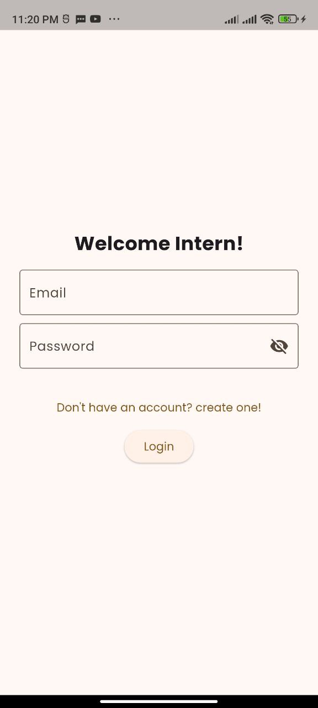
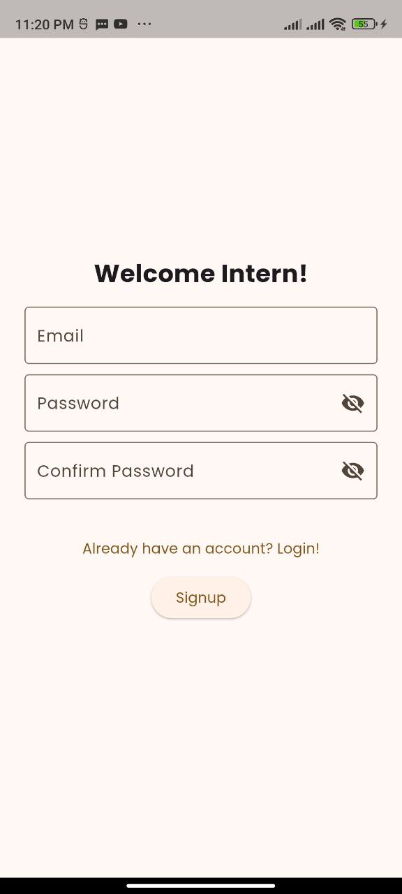
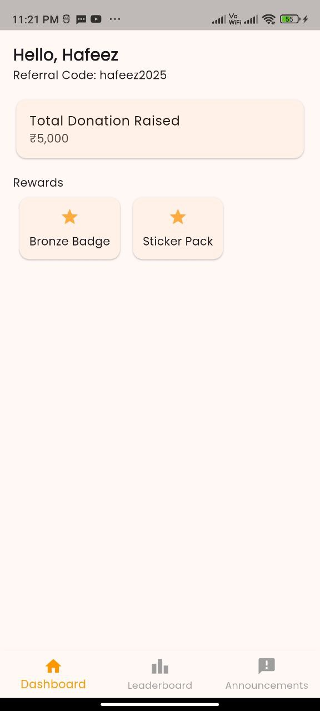

# flutter_intern_portal

# 📲 Fundraising Intern Portal (Flutter UI Demo)

This is a simple **Flutter app UI** that simulates a **fundraising intern portal**, designed primarily for demonstration, prototyping, and portfolio purposes.

The app uses **mock data only**—there is **no backend integration**. It showcases clean, responsive design, smooth navigation, and basic animations.

---

## ✨ Features

✅ **Login/Sign-Up Screen (UI only)**

- Email and password fields
- Show/hide password toggle
- Dummy login flow

✅ **Dashboard**

- Intern name and referral code
- Total donations raised (mock data)
- Rewards/unlockables displayed as static cards

✅ **Leaderboard**

- Static list of top 5 interns with donation scores

✅ **Announcements**

- Simple static messages/announcements

✅ **Bottom Navigation Bar**

- Single scaffold with persistent navigation
- Smooth **fade transitions** between screens

---

## 🎨 Tech Stack

- **Flutter** (stable channel)
- **Google Fonts** for typography
- **AnimatedSwitcher** for transitions
- Clean widget structure and modular codebase

---

## 🚀 Getting Started

1. **Clone the repository:**

   ```bash
   git clone https://github.com/your-username/fundraising-intern-portal.git
   cd fundraising-intern-portal
   ```

## 📸 Screenshots

### Login Screen



### Signup Screen



### 🏠 Dashboard Screen



### 🏆 Leaderboard Screen


### 📢 Announcements Screen


